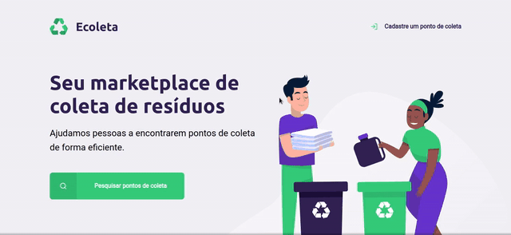

<h1 align = "center"></h1>
<h1 align = "center"></h1>

## :page_facing_up: Sobre

 Projeto desenvolvido durante a **Next Level Week** disponibilizado pela **Rocketseat**. O projeto tem o intuito de aprender novas tecnologias e conhecimentos sobre o desenvolvimento web.

---

### :rocket: Tecnologias

 As tecnologias usadas neste projeto foram:

 - [Node.js](https://nodejs.org/en/)
 - [Express](https://expressjs.com/)
 - [SQLite](https://www.sqlite.org/)
 - [Nunjucks](https://mozilla.github.io/nunjucks/)

---

### :mag: APIs

 - [IBGE](https://servicodados.ibge.gov.br/api/docs/localidades?versao=1)

---

### :computer: Como utilizar

 #### Clone ou faça o download desse repositório:

```bash
$ git clone https://github.com/ 
```

 #### Acesse o diretório raiz e faça a instalação:

```bash
#Instale as dependencias
$ npm install
```
    
 #### Para iniciar o projeto:
 
 Com **npm**
```bash
$ npm start
```

--- 

## :memo: Licença

Esse repositório está licenciado pela **MIT LICENSE**. Para mais informações detalhadas, leia o arquivo [LICENSE](./LICENSE) contido nesse repositório.